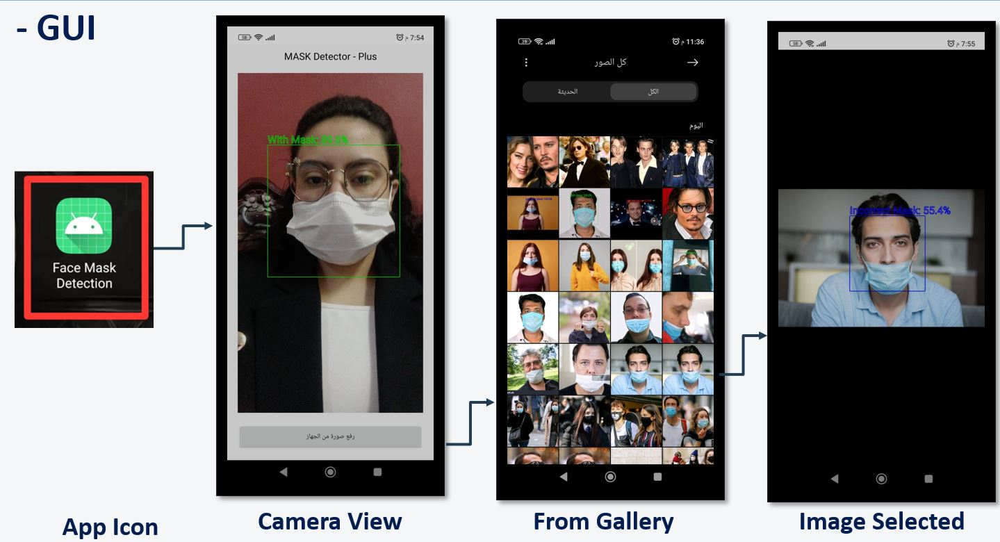

# 😷 Face Mask Detection – Real-time Android App with TFLite

This is a real-time face mask detection system built using [Teachable Machine](https://teachablemachine.withgoogle.com/) and deployed using **TensorFlow Lite** in an Android app.

The model detects if a person is:
- ✅ Wearing a mask properly
- ❌ Not wearing a mask
- ⚠️ Wearing the mask incorrectly

---

## 🎥 Demo Video

📺 **Watch the live demo:**  
👉 [Watch on Google Drive](https://drive.google.com/file/d/1udY0Rx1nNsh_3A_69wGHJ2NRmFVydXge/view?usp=sharing)

---

## 📸 Detection Screenshot

A visual walkthrough of the app from launch to prediction:

---

## 🧠 Model Details

- **Model Type:** Image Classification
- **Trained Using:** Teachable Machine
- **Model Format:** TensorFlow Lite (`.tflite`)
- **Input Size:** 150x150 RGB
- **Output Classes:**
  - WithMask
  - WithoutMask
  - IncorrectMask

---

## 📱 Android App Integration

The model is integrated into a native Android app and supports:
- Live camera detection using `FaceDetector`
- Gallery image classification
- Real-time predictions using TFLite

### 🛠 Tools Used
- TensorFlow Lite
- Google ML Kit (for Face Detection)
- Android Studio (Java/Kotlin)
- Teachable Machine (for training)

---

## 🚀 How to Use

1. Open the project in **Android Studio**.
2. Place the exported `.tflite` model inside the `assets/` directory.
3. Make sure `Interpreter` is correctly loading the model.
4. Build and run the app on a real Android device.
